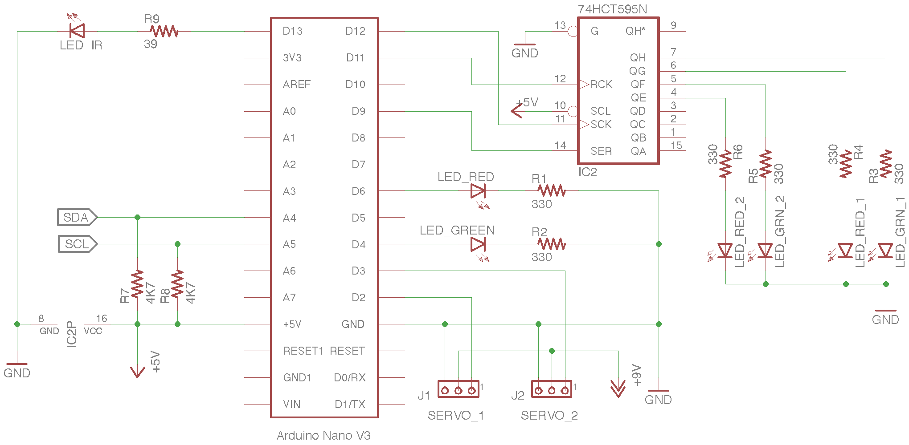

# Circuit diagrams

### RFID Controller

RFID tags are read using MFRC522 modules. The tag number and address of the RFID controller are sent to the train controller via an I2C bus. 

### Train Controller

The train controller manages the points servos, signals, and trains.

