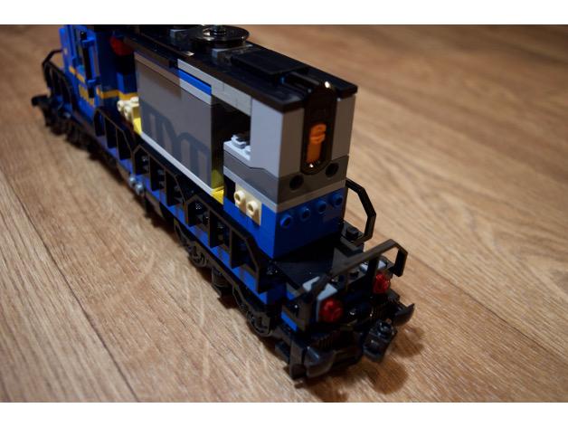

# Custom Lego parts

### Points Servo Module

Points are switched using a custom module containing a mini servo that operates the lever of [Lego Switching Tracks](https://shop.lego.com/en-GB/Switching-Tracks-7895). 

The module consists of multiple parts to allow it to be assembled and fitted more easily. 

Details on [Thingiverse](http://www.thingiverse.com/thing:2020358).

### RFID Track

RFID readers are held in place using custom straight tracks.

Details on [Thingiverse](http://www.thingiverse.com/thing:2020399).

All trains have RFID tags attached to their train motors to allow them to be uniquely identified. Such RFID stickers (aka RFID inlays) are widely available from online retailers and auction sites.

### IR Emitters and Signals

Trains are controlled using TSAL6400 infrared emitters which are housed, together with the train signals, in custom 4x2 bricks. 

Details on [Thingiverse](http://www.thingiverse.com/thing:2022212).

Note that because of the low angle of the IR emitters, the [Lego Cargo Train](https://shop.lego.com/en-GB/Cargo-Train-60052) engine requires minor modifications to the placement of the IR receiver module to ensure that it responds reliably to speed and brake commands. Specifically, the module is raised using a 4x4 frame plate (64799) so that the receiver slightly protrudes above the engine bay. Furthermore the rear cover has been reduced in height by removing the top 1x4x2/3 bowed plate (93273), leaving more of the receiver exposed.  

### Disclaimer

LEGO® is a trademark of the LEGO Group of companies which does not sponsor, authorize or endorse this site.